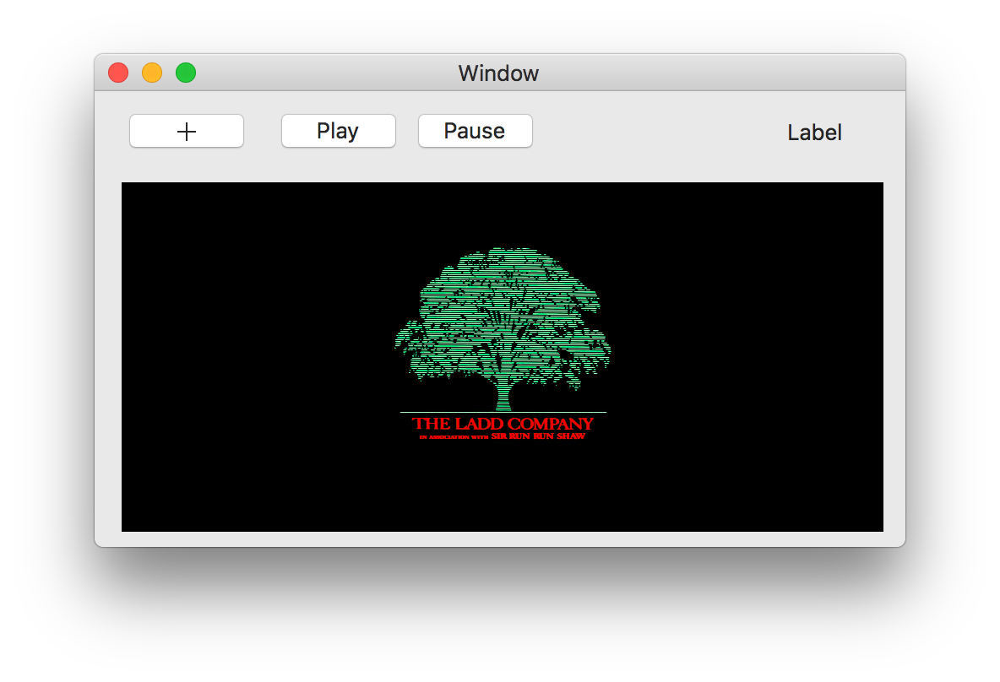

# MPVDemo-macOS
This is a Xamarin macOS Project to example how to Use [MPV](https://github.com/mpv-player/mpv) to play video.



## Basic flow

1. Finding MPV dylibs 
2. Using DllImport to bind dylibs
3. Play video

## Finding MPV Dylibs
The most easiest way is grabbing it from [Here](https://github.com/kevinzhow/MPVDemo-macOS/tree/master/MPVDemo/libs) and all these libs were modified from
[IINA](https://github.com/lhc70000/iina/tree/develop/deps/lib) project.

IINA's original dylibs were using `@rpath` to solve the Search Path which will cause `System.DllNotFoundException`.

You can fix it by `install_name_tool` thanks to [brendanzagaeski](https://brendanzagaeski.appspot.com/xamarin/0004.html).

Quick Example:
```bash
otool -L libavfilter.6.dylib

install_name_tool -change @rpath/libavutil.55.dylib  @loader_path/libavutil.55.dylib  libavfilter.6.dylib
```

## DllImport
DllImport is C# way to do [dlopen](https://developer.xamarin.com/api/type/MonoTouch.ObjCRuntime.Dlfcn/).

You can find the instruction from Xamarin [Website](https://developer.xamarin.com/guides/ios/advanced_topics/native_interop/#Accessing_C_Dylibs).

Quick Example:
```c#
[DllImport("libmpv.1.25.0.dylib", EntryPoint = "mpv_create")]
private static extern IntPtr MpvCreate();
```

## Play

MPV has made a great example of how to interaction mpv with C# at [mpv-exmaples](https://github.com/mpv-player/mpv-examples/blob/master/libmpv/csharp/Form1.cs) and [mpvnet](https://github.com/stax76/mpvnet).

Cocoa platform's specific can also be found at [cocoa-example](https://github.com/mpv-player/mpv-examples/tree/master/libmpv/cocoa)

```c#
var windowId = VideoView.Handle.ToInt64();

MpvInitialize(_mpvHandle);

DoMpvCommand("loadfile", _mediaFilePath);

Play();
```

## Resource

[Property List](https://mpv.io/manual/master/#property-list)
[List of Input Commands](https://mpv.io/manual/master/#list-of-input-commands)